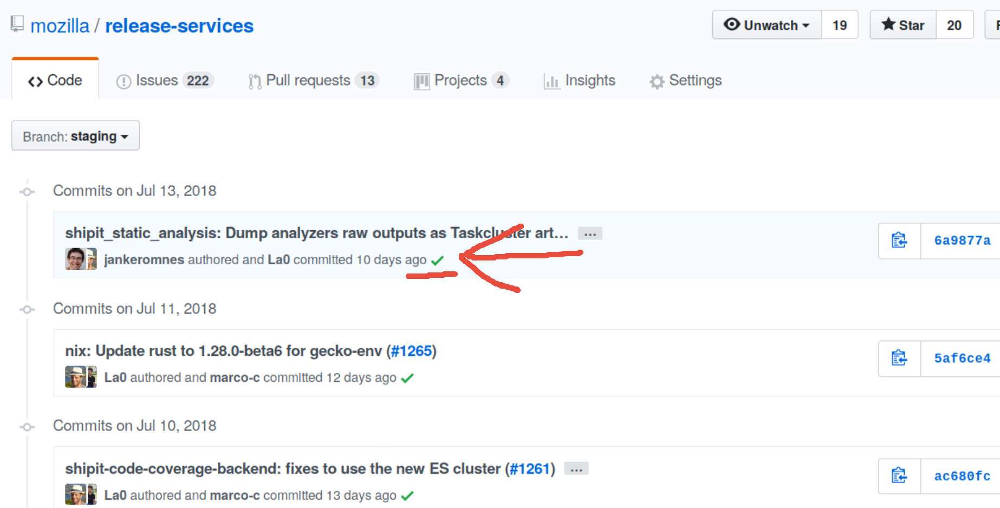
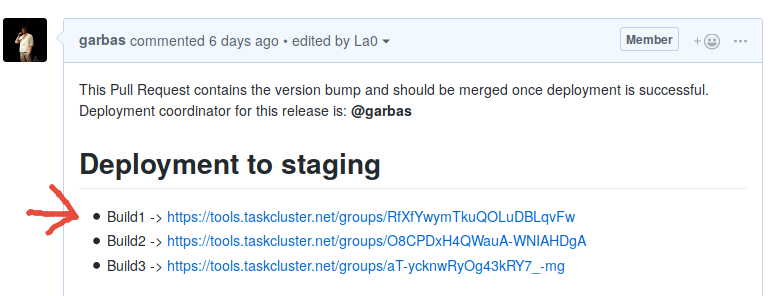

.. _deploy-regular:

Regular releases
================

Push to production happens in regular batches. Usually every second week,
starting on Wednesday (testing on staging) and final deployment to production
on Thursday.

.. _deploy-release-managers:

Current administrators that perform regular releases are:

- `Rok Garbas`_
- `Bastien Abadie`_
- `Rail Aliiev`_
- `Jan Keromnes`_

Release schedule is published in `Release Services calendar`_.

.. _`Rok Garbas`: https://phonebook.mozilla.org/?search/Rok%20Garbas
.. _`Bastien Abadie`: https://phonebook.mozilla.org/?search/Bastien%20Abadie
.. _`Rail Aliiev`: https://phonebook.mozilla.org/?search/Rail%20Aliiev
.. _`Jan Keromnes`: https://phonebook.mozilla.org/?search/Jan%20Keromnes
.. _`Release Services calendar`: https://calendar.google.com/calendar/embed?src=mozilla.com_sq62ki4vs3cgpclvkdbhe3rgic%40group.calendar.google.com

Protocol that we follow is:

1. Push to staging channel
--------------------------

A day before pushing to production (usually on Wednesday morning), we push
release services code to **staging channel**.

To trigger automatic deployment of all project to staging channel you need to
**force push** from ``master`` to ``staging`` branch.

.. code-block:: console

  git clone git@github.com:mozilla/release-services.git
  cd release-services
  git push -f origin origin/master:staging

2. Close staging branch
-----------------------

Once the code you wish to deploy to production is pushed to staging branch, you
need to make sure nobody else can push to staging branch.

To do this you need to `go to Github`_ and mark staging branch as protected, by
removing `-unprotected` suffix as shown bellow.

.. image:: step_2_staging_branch_settings_page.png

.. _`go to Github`: https://github.com/mozilla/release-services/settings/branch_protection_rules/2244704

3. Notify about to start staging deployment
-------------------------------------------

.. todo:: This step is not going to be needed once we finish `#1565`_

To coordinate and inform others please send a message to others in ``#release-services`` IRC channel.

::

  I have pushed to staging branch. Until tomorrow, when we deploy to production, staging branch is closed. You can follow the progress at <LINK_TASKCLUSTER_GRAPH>.

You should provide `<LINK_TASKCLUSTER_GRAPH>` which you can find under Commit status icon on staging branch, example is shown bellow.

Also copy past link to tracking Pull Request of the deployment under respective
build number as shown bellow.

.. -`#1565`: https://github.com/mozilla/release-services/issues/1565

4. Verify if projects are working on staging
--------------------------------------------

Before we push to production, we verify that projects are working on staging.

Each project is verified and reported back to the tracking Pull Request of
the release. This Pull Request is usually open by the end of previous release.

Each project should have a verification guide, which you can follow in their
documentation page.

Once you verify that the project works on staging, you must check it off in
tracking Pull Request for this deployment, as shown bellow.

.. image:: step_4_verified_project_on_staging.png
  
The role of the release manager is that it ensures that all projects are
verified and tested before deploying to production.

5. Announce new deployment to teams that help us monitor projects
-----------------------------------------------------------------

.. todo:: This step wont be needed once `#1568`_ is implemented

Once all project have been tested successfully on staging only then we can
proceed further.

Announce that deployment to production is going to happen shortly:

- on ``#ci`` IRC channel. when
- and on ``#moc`` IRC channel

You can use the following message:::

  I am about to release a new version of mozilla/release-services (*.mozilla-releng.net, *.moz.tools). Any alerts coming up soon will be best directed to me. I'll let you know when it's all done. Thank you!

.. _`#1568`: https://github.com/mozilla/release-services/issues/1568

6. Deploy projects to production
--------------------------------

To deploy all project to production we need to push respected code to
``production`` branch. We also need to tag the commit with version of the
deployment, which can be found in ``./VERSION`` file.

You can follow below command to help you push correctly.

.. code-block:: console

    $ git clone git@github.com/mozilla/release-services.git
    $ cd release-services
    $ git push origin origin/staging:production
    $ git tag v$(cat ./VERSION)
    $ git push origin v$(cat ./VERSION)

Once deployment starts record the taskcluster graph to the tracking Pull
Request of the deployment as shown below.

.. image:: step_6_taskcluster_graph_link.png

7. Verify if projects are working on production
-----------------------------------------------

Each project is verified and reported back to the tracking Pull Request of
the release. This Pull Request is usually open by the end of previous release.

Each project should have a verification guide, which you can follow in their
documentation page.

Once you verify that the project works on production, you must check it off in
tracking Pull Request for this deployment, as shown bellow.

.. image:: step_7_verified_project_on_production.png
  
The role of the release manager is that it ensures that all projects are
verified and tested before deploying to production.

8. Write the release notes
--------------------------

`Create the release notes`_ on GitHub and use tag we created in step 7.

A good starting point for writing release notes is:

.. code-block:: console

    $ git log --oneline v$((($(cat VERSION)) - 1)).. HEAD \
        | cut -d' ' -f2- \
        | sort \
        | grep -v 'setup: bumping to'

.. _`Create the release notes`: https://github.com/mozilla/release-services/releases/new

8. Bump version
---------------

**DO NOT** push upstream just yet.

.. code-block:: console

    $ git clone git@github.com/mozilla/release-services.git
    $ cd release-services
    $ echo "$((($(cat VERSION)) + 1))" | tee VERSION2
    $ sed -i -e "s|base-$(cat VERSION)|base-$(cat VERSION2)|" .taskcluster.yml
    $ mv VERSION2 VERSION

9. Push new base image for new version
--------------------------------------

.. code-block:: console

    $ ./please -vv tools base-image \
         --taskcluster-client-id="..." \
         --taskcluster-access-token="..."

Docker username and password you get in `staging secrets`_ or `production
secrets`_ secrets.

It might happen that push to docker hub will fail since the resulting docker
image is quite big (~1.5GB). When it fails you can only retrigger the
``docker push`` command.

.. code-block:: console

    $ docker push mozillareleng/services:base-$(cat ./VERSION)

10. Commit the version bump
---------------------------

Once base image is pushed to docker hub, commit the version bump and push it
to upstream repository.

.. code-block:: console

    $ git commit VERSION .taskcluster.yml -m "setup: bumping to v$(cat ./VERSION)"
    $ git push origin master

Make sure that commit gets properly build before proceeding. This will
ensure that docker base image created in previous steps is working.

11. Announce that deployment to production is done
--------------------------------------------------

- announce in ``#ci`` channel that a push to production is complete.

  Example message::

      Previously annonced release of mozilla/release-services
      (*.mozilla-releng.net, *.moz.tools) to productions is now complete. If
      you see anything behaving weird please let me know. Changes ->
      <link-to-release-notes>.

- inform MOC person on duty (in ``#moc`` channel) that deployment of
  ``mozilla/release-services`` is complete.

  Example message::

      nickname: Previously annonced release of mozilla/release-services
      (*.mozilla-releng.net, *.moz.tools) to productions is now complete.
      Changes -> <link-to-release-notes>.

.. _`Rok Garbas`: https://phonebook.mozilla.org/?search/Rok%20Garbas
.. _`Bastien Abadie`: https://phonebook.mozilla.org/?search/Bastien%20Abadie
.. _`Rail Aliiev`: https://phonebook.mozilla.org/?search/Rail%20Aliiev
.. _`staging secrets`: https://tools.taskcluster.net/secrets/repo%3Agithub.com%2Fmozilla-releng%2Fservices%3Abranch%3Astaging
.. _`production secrets`: https://tools.taskcluster.net/secrets/repo%3Agithub.com%2Fmozilla-releng%2Fservices%3Abranch%3Aproduction
