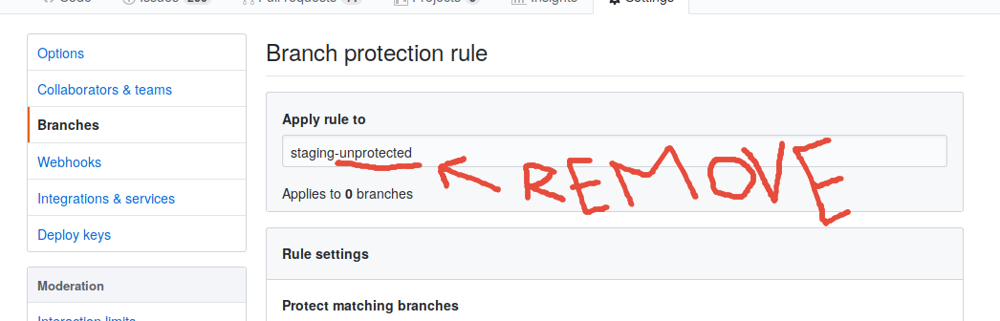
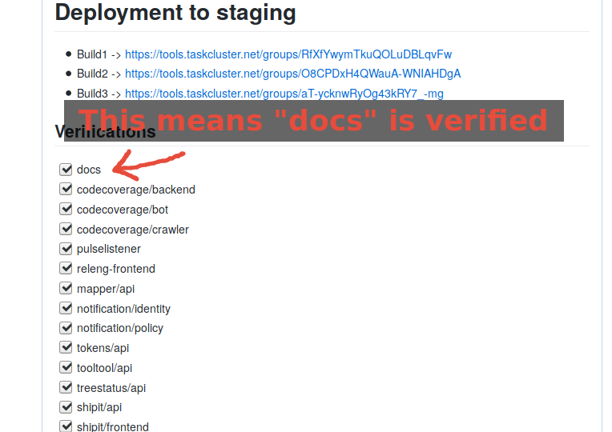
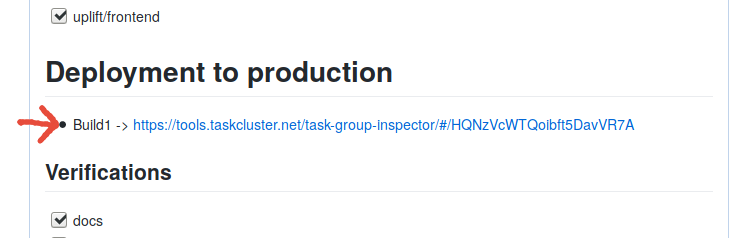
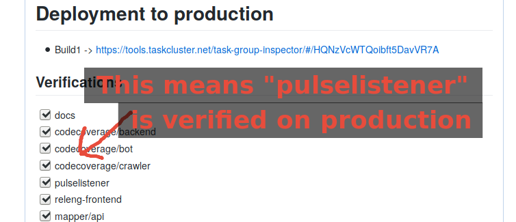

.. _deploy-regular:

Regular releases
================

Push to production happens in regular batches. Usually every second week,
starting on Wednesday (testing on staging) and final deployment to production
on Thursday.

.. _deploy-release-managers:

Current administrators that perform regular releases are:

- `Rok Garbas`_
- `Bastien Abadie`_
- `Rail Aliiev`_
- `Jan Keromnes`_

Release schedule is published in `Release Services calendar`_.

.. _`Rok Garbas`: https://phonebook.mozilla.org/?search/Rok%20Garbas
.. _`Bastien Abadie`: https://phonebook.mozilla.org/?search/Bastien%20Abadie
.. _`Rail Aliiev`: https://phonebook.mozilla.org/?search/Rail%20Aliiev
.. _`Jan Keromnes`: https://phonebook.mozilla.org/?search/Jan%20Keromnes
.. _`Release Services calendar`: https://calendar.google.com/calendar/embed?src=mozilla.com_sq62ki4vs3cgpclvkdbhe3rgic%40group.calendar.google.com

Protocol that we follow is:

1. Push to staging channel
--------------------------

A day before pushing to production (usually on Wednesday morning), we push
release services code to **staging channel**.

To trigger automatic deployment of all project to staging channel you need to
**force push** from ``master`` to ``staging`` branch.

.. code-block:: console

  git clone git@github.com:mozilla/release-services.git
  cd release-services
  git push -f origin origin/master:staging

2. Close staging branch
-----------------------

Once the code you wish to deploy to production is pushed to staging branch, you
need to make sure nobody else can push to staging branch.

To do this you need to `go to Github`_ and mark staging branch as protected, by
removing `-unprotected` suffix as shown bellow.

.. _`go to Github`: https://github.com/mozilla/release-services/settings/branch_protection_rules/2244704

3. Verify if projects are working on staging
--------------------------------------------

Before we push to production, we verify that projects are working on staging.

Each project is verified and reported back to the tracking Pull Request of
the release. This Pull Request is usually open by the end of previous release.

Each project should have a verification guide, which you can follow in their
documentation page.

Once you verify that the project works on staging, you must check it off in
tracking Pull Request for this deployment, as shown bellow.

The role of the release manager is that it ensures that all projects are
verified and tested before deploying to production.

4. Deploy projects to production
--------------------------------

To deploy all project to production we need to push respected code to
``production`` branch. We also need to tag the commit with version of the
deployment, which can be found in ``./VERSION`` file.

You can follow below command to help you push correctly.

.. code-block:: console

    git clone git@github.com:mozilla/release-services.git
    cd release-services
    git push origin origin/staging:production
    git tag v$(cat ./VERSION) origin/staging
    git push origin v$(cat ./VERSION)

Once deployment starts record the taskcluster graph to the tracking Pull
Request of the deployment as shown below.

5. Verify if projects are working on production
-----------------------------------------------

Each project is verified and reported back to the tracking Pull Request of
the release. This Pull Request is usually open by the end of previous release.

Each project should have a verification guide, which you can follow in their
documentation page.

Once you verify that the project works on production, you must check it off in
tracking Pull Request for this deployment, as shown bellow.

The role of the release manager is that it ensures that all projects are
verified and tested before deploying to production.

6. Announce that deployment to production is done
-------------------------------------------------

An automatic IRC message has been sent by Taskcluster when starting the deployment. You need to announce that deployment to production is now done:

- on ``#ci`` IRC channel. when
- and on ``#moc`` IRC channel

You can use the following message:::

  Previously annonced release of mozilla/release-services (*.mozilla-releng.net, *.moz.tools) to productions is now complete. If you see anything behaving weird please let me know.

7. Write the release notes
--------------------------

`Create the release notes`_ on GitHub and use tag we created in step 7.

A good starting point for writing release notes is:

.. code-block:: console

    git log --oneline v$((($(cat VERSION)) - 1)).. HEAD \
        | cut -d' ' -f2- \
        | sort \
        | grep -v '^Deploying '

.. _`Create the release notes`: https://github.com/mozilla/release-services/releases/new

8. Push new base image
-----------------------

This step will take some time (~30-60min) also good Internet connection is
required.

First we install docker inside our existing base image:

.. code-block:: console

    git clone git@github.com:mozilla/release-services.git
    cd release-services
    ./please tools docker-shell
    nix-env -f /etc/nix/nixpkgs -iA docker

You now have `docker` in your Docker shell. But you *may* not have read access to the Docker socket.
To check this, simply type:

.. code-block:: console

    docker ps

If you do not see the list of your running containers but a connection error, you need to do the following (in your docker shell, not on your host machine):

.. code-block:: console

    sudo addgroup --gid 999 docker
    sudo adduser app docker

This will add the current user to the docker group, thus granting him access (after opening another shell to check your new rights !)

In another terminal we apply the PR to bump the version

.. code-block:: console

    curl -L https://github.com/mozilla/release-services/pull/<PR_NUMBER>.patch | git am

Back in our docker shell we then build and then push docker image:

.. code-block:: console

    ./please -vv tools build-base-image \
        --taskcluster-secret="repo:github.com/mozilla-releng/services:branch:production" \
        --taskcluster-client-id="..." \
        --taskcluster-access-token="..."
    ./please -vv tools push-base-image \
        --taskcluster-secret="repo:github.com/mozilla-releng/services:branch:production" \
        --taskcluster-client-id="..." \
        --taskcluster-access-token="..."

Once base image is pushed to Docker Hub we can merged tracking Pull Request of
this deployment. Before that, hit **Update branch** button to re-trigger Taskcluster
builds, which would verify if above created base image is working correctly.

If Taskcluster build for the Pull Request turns out green go ahead and merge it.

9. Bump version and create new deployment PR
--------------------------------------------

All we need to do now is create a new Pull Request and bump the version, which
is going to be used next time we do deployment.

.. code-block:: console

    git clone git@github.com:mozilla/release-services.git
    cd release-services
    git checkout -b version-bump origin/master
    echo "$((($(cat VERSION)) + 1))" | tee VERSION2
    sed -i -e "s|base-$(cat VERSION)|base-$(cat VERSION2)|" .taskcluster.yml
    mv VERSION2 VERSION
    git commit -a -m "Deploying v$((($(cat VERSION)) - 1)) (and bumping version to v$(cat VERSION))"
    git push origin version-bump -f

Now open a Pull Request from ``version-bump`` to ``master`` branch and copy
title and description from previous tracking Pull Request.
