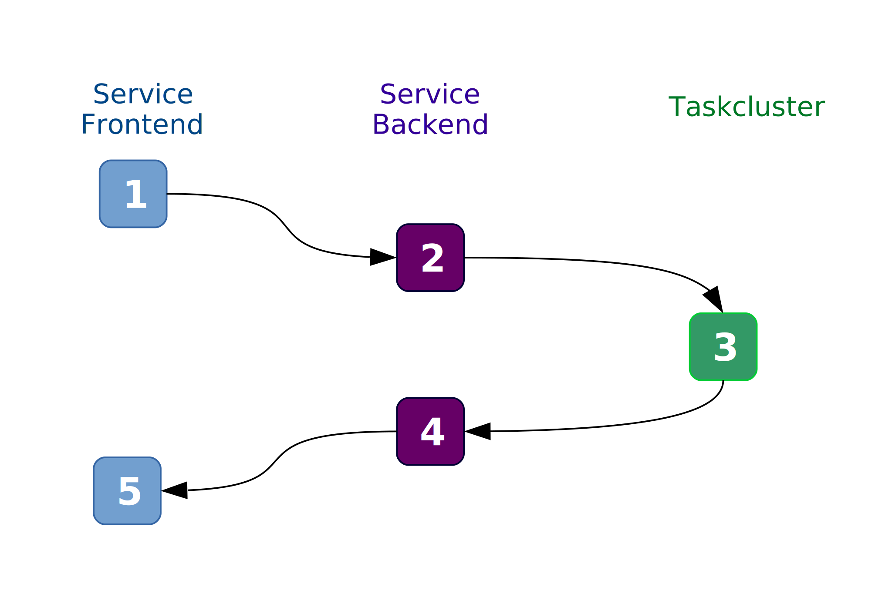

Authentication
==============

Users for the Releng Api services are not stored in any backend. They are directly managed by `Mozilla Taskcluster`_

This enforces good security measures, and minimises the impact of potential vulnerabilities in the services.

This documentation covers the web architecture for Releng services, in two parts:
 
1. A user facing Javascript frontend,
2. A Python backend exposing an API.

Taskcluster Auth
----------------

The user can get its credentials directly from the `login provider`_ of Taskluster, or grant access to the service frontend through a delegation workflow (think Oauth2).

Even if the user does not have access to your services (see the Scopes paragraph), it will get some credentials from Taskcluster: it's the responsability of your backend to check users scopes.
Once the Releng service gets some user credentials, the frontend can store them in the browser localStorage, but never send them directly to the backend.

Taskcluster uses the `HAWK`_ protocol to authenticate API requests.
Each client (a user device) must provide a unique Authorization header **per request** derived from some known credentials:

 * a clientId, like :code:`provider/user@mozilla.com`
 * an accessToken
 * an optional certificate

Workflow
~~~~~~~~

A typical authenticated request follows these steps:

1. The service frontend build an Hawk header for the service backend endpoint, then sends the request.
2. The service backend, before running any project code, forwards the :code:`Authorization` it received to Taskcluster `authenticateHawk`_ method.
3. Taskcluster validates the payload it received, and returns authentication details for the user (clientId & scopes, but no token)
4. The service backend receives the scopes, checks them against a list of required scopes, and executes the project codes.
5. The service frontend simply receives the output of the api call (ie. the resources it wanted to access)

Backend usage
~~~~~~~~~~~~~

The **auth** application in `backend_common`_ uses a Taskcluster Auth endpoint `authenticateHawk`_ to validate an HAWK header provider by your service frontend. The backend receives the list of scopes available to the user, and can immediately check them against a known list.

This process is exposed to your backend python code through a single decorator:

.. code-block:: python

    from backend_common.auth import auth
    from flask import jsonify
    from flask_login import current_user

    @auth.require_scopes(['project/test/user', 'project/test/resource'])
    def api_endpoint():
        return jsonify({"user" : current_user.get_id()})

The :code:`require_scopes` decorator supports:

 * a list of scopes, to describe a single role
 * a list of list of scopes, to describe several roles who can access the endpoint

As you can see, once logged, the :code:`current_user` from `Flask Login`_ becomes a :code:`TaskclusterUser` instance also described in `backend_common`_ You can easily access the clientId and scopes for the logged in user this way.
    
Frontend usage
~~~~~~~~~~~~~~

.. warning::
    A refactoring of this part is in process: a separate Elm project is being created to ease this process.

The frontend must provide at least two operations to authenticate an user:

  * store and read raw credentials in localStorage
  * build an HAWK header for any request toward the backend

We use the Javascript `HAWK`_ client in ELM through some ports. This adds some complexity, but it's the only way to create efficiently an HAWK header in ELM at this point (November 2016).

For every requests sent to the backend, the frontend builds at least one Authorization header, to authenticate the endpoint in the request.

For example, if we want to make a POST request on our :code:`api_endpoint` previously described, available on `https://localhost:8000/api_endpoint`, we need to build the header with these settings

.. code-block:: javascript

    var Hawk = require('hawk');
    var creds = localStorage.getItem('releng-creds');
    var url = 'https://localhost:8000/api_endpoint';

    // Embed optional certificate
    var extData = null;
    if(creds.certificate)
      extData = new Buffer(JSON.stringify({certificate: creds.certificate})).toString('base64');

    // Generic payload for both headers
    var payload = {
      credentials: {
        id: creds.clientId,
        key: creds.accessToken,
        algorithm: 'sha256'
      },
      ext: extData,
    };

    var header = Hawk.client.header(url, 'POST', payload);
    // Then use header.field in your request Authorization header

But if the api endpoint makes another request towards a Taskcluster service (fetch some secret, start a task, ...), you need to provide another header to the backend, for this extra request.
Our frontend in elm adds an extra header :code:`X-Authorization-Target` (WIP)
    

Taskcluster Secrets
-------------------

It's simple: **we can't use them for any authentication purpose**. They are not made to store "human" secrets, but to share secrets from humans to processes/machines.

There is no private place in Taskcluster secrets for a user (especially not :code:`garbage/*`).

.. note::
    For example: you can't store Bugzilla API tokens in Taskcluster secrets, you need to store them in the user browser localStorage (exactly like we do for Taskcluster auth).

Setup roles & scopes
--------------------

Most Mozilla users do not have the necessary credentials to create public roles (not set on their own userspace). You can see your actual credentials on `Taskcluster tools`_, after signing in.

So you need to ask an administrator on IRC #taskcluster to add new admin scopes for a new project (they will use this script: `make-project-admin-role.js`_ (checkout the simple code that lists all your future scopes)

Once the new scopes acquired on your account, you will be able to:

 * create `some scopes <https://tools.taskcluster.net/auth/roles/>`_ in your project space,
 * create `some role <https://tools.taskcluster.net/auth/roles/>`_ that use those scopes,
 * create some client with those scopes to auth a bot, or any automated task,
 * manage some secrets in your project space.

The authentication strategy and resources repartition is up to you, but you should geenrally end up with several roles (one for user, one for admins, one for bots, ...) embedding different scopes.

Those scopes should then be required in your backend through the previously explained :code:`require_scopes`.

To learn more about scopes & roles in Taskcluster, read the `official documentation <https://docs.taskcluster.net/manual/apis/scopes>`_.

Bugzilla
--------

.. note::

  This paragraph is of course optional, but may interest developers that wish to use Bugzilla data in their project.

Unfortunately, you cannot use `Bugzilla Auth delegation`_ in your app. This process would enable a Bugzilla user to create automatically an api key for your service, and send it over cleanly (think Oauth2).

But it needs to make a POST request towards your frontend, as the subsequent GET request in theur workflow does not contain the api key. So for our web architecture, we need users to input manually their Api token.

Security wise, this is not an issue: the api token is then stored in :code:`localStorage`.

.. _`Mozilla Taskcluster`: https://docs.taskcluster.net
.. _`HAWK`: https://github.com/hueniverse/hawk
.. _`login provider`: https://login.taskcluster.net/
.. _`backend_common`: https://github.com/mozilla-releng/services/blob/master/lib/backend_common/backend_common/auth.py
.. _`authenticateHawk`: https://docs.taskcluster.net/reference/platform/auth/api-docs#authenticateHawk
.. _`Flask Login`: https://flask-login.readthedocs.io/en/latest/
.. _`Taskcluster tools`: https://tools.taskcluster.net/credentials/
.. _`make-project-admin-role.js`: https://github.com/taskcluster/taskcluster-admin/blob/master/src/make-project-admin-role.js
.. _`Bugzilla Auth delegation`: https://bugzilla.readthedocs.io/en/latest/integrating/auth-delegation.html
